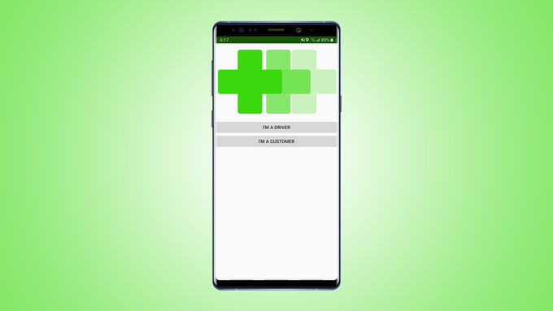

# PharmaDashIos

PharmaDash is the app that will provide you with your necessary medicinal needs. Through the use of crowd-sourcing functionality, all the deliveries and orders are placed by customers, which will allows rapid access. Anyone qualified to drive can potentially become a driver, and anyone can order the medication. Teenagers, sick parents, and senior citizens will most likely be the primary users of the app, but any individual can request. The medicine will STRICTLY be limited to Schedule 4: over the counter medication, which falls under regulation as settled by the Alberta College of Pharmacists.

It all just starts with the touch of a screen. Imagine a frigid blizzard blistering through your city. All alone in your house with a bad case of the cold, you are in desperate need of medication. Prior to PharmaDash, you would have either had to get the medication delivered to you by a family member, or you would have taken the case into your own hands. According to surveys conducted, driving with a common cold is equivalent to driving having drank a double whiskey.  With PharmaDash, this problem fades away, similar to your cold after taking the medication.

  

 Login screen of the app 

The first step in getting your medication is to create an account by entering your email and choosing a password. Signing in to the app will present you with your central hub. 

  

 Central hub of the app for customers 

Here, you will be presented with the option of choosing your desired medication.  The option of choosing a specific pharmacy to take advantage of discounts is also integrated into the app. From here, the app will choose the closest driver though precise algorithmic calculations. The driver will then travel to the chosen pharmacy, pick up the medication and then deliver it to your house. It's as easy as that.
 
 

  

 Central hub for driver when he receives a delivery request 

The payment is also another component that we have been working hard on to ensure that it is integrated seamlessly into the app. The driver will initially purchase the medication from his own wallet, but he will be reimbursed when the delivery is finished. After delivering the medication, the driver will scan the receipt into the app, which provides the customer with verification of the purchase. The driver will also have to enter the total amount spent on the medicine, which is further verified by the customer. After the customer receives the medication and verifies the purchase, they will pay the fee with added delivery costs.

  

 Previous ride history screen 

The process is as easy as it seems. Through seamless integration of Google Maps and payment methods, PharmaDash will act as your gateway towards healing. 
